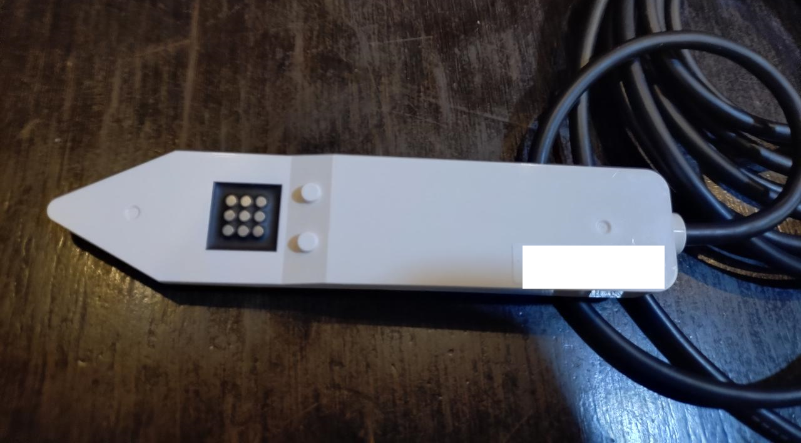

# 村田製作所製 土壌センサ(SLT5006) ドライバ

Spresense 上で 村田製作所製 土壌センサ(SLT5006)を UART 接続で扱うためのライブラリです。

## 対応ボード

- Sony Spresense

## センサー紹介

[村田製作所製 土壌センサ(SLT5006)](https://www.murata.com/ja-jp/products/sensor/soil)　

Murata SLT5006 は、土壌状態を UART 通信で取得できる土壌センサです。
このライブラリでは、1 回の計測サイクルで次の代表値を扱えます。

- `temp`: 温度
- `vwc`: 体積含水率
- `ec_pore`: 間隙水の電気伝導度

本ライブラリは Spresense から `Serial2` 経由で SLT5006 にアクセスし、
計測開始 (`send`) -> 応答受信 (`receive`) -> 値取得 (`temp`/`vwc`/`ec_pore`) の流れを簡潔に実装できるようにしています。

必要な配線は、SLT5006 と Spresense の UART (TX/RX) と EN 制御線、共通 GND です。
配線の物理ピン割り当ては使用するボード定義/キャリアボードに依存します。

## インストール

1. このフォルダを Arduino の libraries 配下に配置します。
2. スケッチから `SLT5006.h` を include できることを確認します。

## サンプル

- サンプルスケッチ: `examples/sample/sample.ino`
- 内容: `Serial2` で SLT5006 を初期化し、計測トリガを実行して、完了待ち後に `temp` / `vwc` / `ec_pore` をシリアル出力します。

## 公開 API

### コンストラクタ

- `SLT5006(HardwareSerial &serial = Serial2, uint8_t enablePin = 2)`

### 初期化と終了

- `void begin()`
- `void end()`

### 電源・計測制御

- `bool enable()`
- `bool disable()`
- `bool send()`
- `bool receive(uint32_t timeoutMs)`
- `bool state()`

### バージョン情報

- `bool version(uint8_t &major, uint8_t &minor, uint8_t &rev)`

### センサ値取得

- `float temp()`
- `float vwc()`
- `float ec_pore()`

## 使い方フロー

1. UART と EN ピンを指定して `SLT5006` インスタンスを生成します。
2. `setup()` で `begin()` を一度呼びます。
3. `enable()` でセンサを有効化します。
4. 必要に応じて `version(...)` で通信確認します。
5. `loop()` で以下を繰り返します。
6. `send()` で 1 回分の計測を開始します。
7. `receive(timeoutMs)` で計測完了まで待ちます。
8. `temp()` / `vwc()` / `ec_pore()` でデータを取得します。
9. 必要な周期で繰り返します。

フロー要約: `begin -> enable -> send -> receive -> read values -> repeat`

---

## English

SLT5006 is a UART library for Murata SLT5006 soil sensor on Spresense.

### Supported board

- Sony Spresense

### Sensor overview

[Murata Soil Sensor(SLT5006)](https://www.murata.com/ja-jp/products/sensor/soil)　

Murata SLT5006 is a soil sensor that provides soil-state data over UART.
With this library, each measurement cycle exposes these key values:

- `temp`: temperature
- `vwc`: volumetric water content
- `ec_pore`: pore-water electrical conductivity

This library targets Spresense and keeps the measurement sequence simple:
start measurement (`send`) -> wait for response (`receive`) -> read values (`temp`/`vwc`/`ec_pore`).

Required wiring is UART (TX/RX), an EN control line, and common GND between sensor and board.
Physical pin mapping depends on your board definition / carrier board.

### Installation

1. Place this folder under your Arduino libraries directory.
2. Confirm `SLT5006.h` is available from your sketch.

### Sample

- Example sketch: `examples/sample/sample.ino`
- Purpose: initialize SLT5006 over `Serial2`, trigger measurement, wait for completion, and print `temp`, `vwc`, `ec_pore` to serial monitor.

### Public API

- Constructor: `SLT5006(HardwareSerial &serial = Serial2, uint8_t enablePin = 2)`
- Initialization / shutdown: `begin()`, `end()`
- Power/measurement control: `enable()`, `disable()`, `send()`, `receive(timeoutMs)`, `state()`
- Device information: `version(uint8_t &major, uint8_t &minor, uint8_t &rev)`
- Sensor values: `temp()`, `vwc()`, `ec_pore()`

### Usage flow

1. Create an instance with UART and enable pin.
2. Call `begin()` once in `setup()`.
3. Call `enable()`.
4. Optionally call `version(...)`.
5. In loop: `send()` -> `receive(timeoutMs)` -> get data with `temp()`, `vwc()`, `ec_pore()`.
6. Repeat at your required interval.
